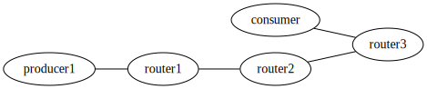

# NDN-FC WorkflowPlus Tracing

NDN-FC WorkflowPlus をトレーシングするシステムをまとめたリポジトリ

未整理...

## ディレクトリ説明

1. `ndn_clients`: function や consumer, producer などのクライアントたち
2. `network_gen` & `config`: NDN ネットワークを構築するためのシステム
3. `lua`: ログエージェントの実装と、wiresharkがNDNをトレースするためのプラグインが入っている
4. `log_server`: トレーシング関連のコードが入っている

## log_server の中身
* node graph API (log_server/visualization/src/app.py) -> データベースから node graph を集計し、grafana から呼び出せるようにしたもの
これを node graph ダッシュボードに刺すといい感じにデータが見れる
```
docker compose exec log-api bash
cd /app
python3 src/app.py
```
```
http://log-api:8080/nodes?request_id={}
http://log-api:8080/edges?request_id={}
```
* OpenTelemetry変換システム (/log_server/src/main.js) -> 任意のタイミングで送信していないデータを全て Otel 形式に変換して送る

```
docker compose exec app ash
```
```
sh /tracing/run.sh 
```

## お試しの動かし方

DB と grafana を空にしておく

1. ndnネットワークの作成&起動
```
cd network_gen
python3 main.py
```

2. log_server の起動 & grafana へのアクセス
```
cd log_server
docker compose up --build 
```

3. node graph 用のAPIを作成

```
cd log_server
docker compose exec log-api bash
cd /app
pip install -r requirements.txt
python3 src/app.py
```

4. consumer1 の実行 -> 構成は consumer1.py
```
cd generated
docker compose exec consumer1 bash
python3 ndn_clients/consumer1.py
```

5. grafana tempo への反映

```
cd log_server
docker compose exec app ash
apk add --update nodejs npm
sh run.sh
```

6. consumer2 の実行 -> 構成は consumer2.py
```
cd generated
docker compose exec consumer2 bash
python3 ndn_clients/consumer2.py
```

7. grafana tempo への反映
service graph が前含めて全部見えてしまうことを確認

```
sh run.sh
```

8. DB より Request ID を取得し、node graph でクエリできることを確認


## ネットワークの変え方

`/network_gen` 配下に NDN Network を CSV に設定を書くだけで自動的に構築する [NDN Network Generator](https://github.com/kobayashiharuto/NDN-network-generator) というシステムを用いています。

ノードの設定、NLSR の設定、face を貼るところまで全て自動で行います。

### 依存関係のインストール

```
cd network_gen
pip install -r requirements.txt
```

### 使い方

1. `config/network_relations.csv` にネットワークのつながりを記述
1. `config/node_info.csv` にそれぞれのノード起動時のコマンドを記述
1. 起動
1. それぞれのコンテナに入る

### 1. `config/network_relations.csv` にネットワークのつながりを記述

`network_relations.csv` にはノード間のつながりを記述します。

```csv
node1,node2
router1,router2
router2,router3
producer1,router1
consumer,router3
```

一番最初の node1,node2 はヘッダーです。

上記の記述であれば、`router1 と router2`, `router2 と router3`, `producer1 と router1`, `consumer と router3` が相互につながったネットワークという意味になります。




### 2. `config/node_info.csv` にそれぞれのノード起動時のコマンドを記述

次に、`node_info.csv` にそれぞれのノードで実行するコマンドを書いていきます。

```csv
node_name,command
router1,""
router2,""
producer1,"python3 ./ndn_clients/producer.py /producer1"
function1,"python3 ./ndn_clients/function.py /function1"
consumer,""
```

特に実行しない場合は空文字列を入れます。

また、`ndn_clients/` にサンプル的に動かせる producer や function のプログラムがあります。

### 3. 起動

以下で起動します。これにより、自動的に全てのノードが生成され、設定を元にNLSRの設定がされ、faceが貼られ、設定した起動時コマンドが実行されます。

```shell
python src/main.py
```

### 4. それぞれのコンテナに入る

`docker-compose.yml` は `generated/` の中に自動的に生成されています。

このディレクトリに移動すれば `docker compose` 系のコマンドを使うことができます。

以下のようにコンテナに入れます。(ノード名が `producer` のコンテナに入りたい場合。指定したノード名とコンテナ名は対応しています。)

```shell
docker compose exec consumer bash
```